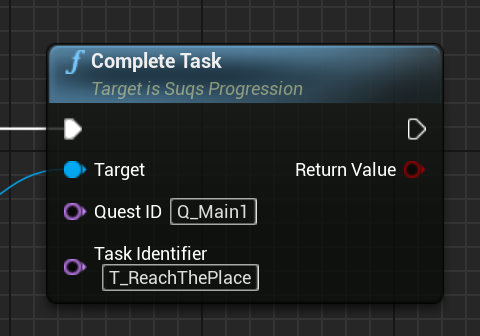

# Steve's Unreal Quest System (SUQS)

## What Is It?

SUQS is a simple, data-driven quest system for Unreal Engine. It helps you define quest structures for your game, 
and track progress against those quests for a player in a simple way. 

All quests are defined in static asset datatables, which can either be edited directly in UE, or written
as JSON - a schema is provided to provide handy autocomplete and validation in most editors 
(see [Editor Setup](docs/EditorSetup.md)).

At runtime, you use a simple API to record progress against these quests: accept quests, complete tasks,
increment progress etc. As tasks are completed they trigger progression based on simple rules, and callbacks
and a query API let you reflect those changes in your world.


## Installing

### Cloning

The best way is to clone this repository as a submodule; that way you can contribute
pull requests if you want. The project should be placed in your project's Plugins folder.

```
> cd YourProject
> git submodule add https://github.com/sinbad/SUQS Plugins/SUQS
> git add ../.gitmodules
> git commit
```

Alternatively you can download the ZIP of this repo and place it in 
`YourProject/Plugins/SUQS`.

### Referencing in C++

Edit YourProject.Build.cs and do something similar to this:

```csharp
using System.IO;
using UnrealBuildTool;

public class YourProject : ModuleRules
{
	private string PluginsPath
	{
		get { return Path.GetFullPath( Path.Combine( ModuleDirectory, "../../Plugins/" ) ); }
	}
	
	protected void AddSUQS() {
		// Linker
		PrivateDependencyModuleNames.AddRange(new string[] { "SUQS" });
		// Headers
		PublicIncludePaths.Add(Path.Combine( PluginsPath, "SUQS", "Source", "SUQS", "Public"));
	}

	public SUQSExamples(ReadOnlyTargetRules Target) : base(Target)
	{
		PCHUsage = PCHUsageMode.UseExplicitOrSharedPCHs;

		PublicDependencyModuleNames.AddRange(new string[] { "Core", "CoreUObject", "Engine", "InputCore" });
		
		AddSUQS();
	}
}
```

After adding this you should right-click your .uproject file and "Generate Visual
Studio Project Files". 

## Usage Overview

### Defining Quests

Quests are static data tables stored in assets. They can't be altered dynamically, and this is deliberate;
not only does it keep the implementation simpler, it means you always have a single source of truth for
your quest structure.

That doesn't mean you can't have branching quests. Branching within a quest is supported (the branches
are predefined in the data), and also quests can be dependent on each other's success or failure. 


While you can edit quest data tables in the UE5 editor, let's see a JSON example 
because it's the easiest to see easily. You can configure your editor to
provide auto-complete and documentation, see [Editor Setup](docs/EditorSetup.md). 
There are lots of optional features, so here is the simplest possible quest:

```json
[
  {
    "Identifier": "Q_Smol",
    "Title": "NSLOCTEXT(\"TestQuests\", \"SmolQuestTitle\", \"Smol Quest\")",
    "DescriptionWhenActive": "NSLOCTEXT(\"TestQuests\", \"SmolQuestDesc\", \"The smallest possible quest\")",
    "Objectives": [
      {
        "Tasks": [
          {
            "Identifier": "T_Smol",
            "Title": "NSLOCTEXT(\"TestQuests\", \"SmolQuestTaskTitle\", \"Easiest possible thing\")"
          }
        ]
      }
    ]
  }
]
```

Some basic notes:
* A single JSON file can include multiple [Quests](docs/Quests.md), each of which must have a globally unique Identifier
* All player-visible text can be localised using NSLOCTEXT
* Each quest is comprised of 1 or more [Objectives](docs/Objectives.md)
  * Objectives are always sequential (but can [branch](docs/Branching.md))
  * Objectives contain [Tasks](docs/Tasks.md), which are the unit of progression
  * Objectives group Tasks, determining whether they are sequential or flexibly ordered, or whether all mandatory tasks have to be completed or only 1 (or 2, or 3...) of those in the group, 
  * Tasks track actual progress, can be mandatory or optional, and can have target numbers (e.g. collect 3 otter's noses, 7 ocelot spleens), and time limits

More details on the specifics can be found in [Quests](docs/Quests.md).

### Quest Progression

Quest definitions are static, but of course your players will progress through
them over time. The main object you'll interact with in SUQS is `USuqsProgression`,
which tracks this, and holds the quest definition library as well. 

It's through `USuqsProgression` that you'll accept quests, complete tasks, 
and store the current status of active quests, and permanently store the quest archive.
For example:




This object can be serialized for inclusion in save games. 

See [Quest Progression](docs/Progression.md) for more details.

## More Information

* [Quest Definitions](docs/Quests.md)
* [Quest Progression](docs/Progression.md)

## License

The MIT License (MIT)
Copyright © 2021 Steve Streeting

Permission is hereby granted, free of charge, to any person obtaining a copy of
this software and associated documentation files (the “Software”), to deal in
the Software without restriction, including without limitation the rights to
use, copy, modify, merge, publish, distribute, sublicense, and/or sell copies of
the Software, and to permit persons to whom the Software is furnished to do so,
subject to the following conditions:

The above copyright notice and this permission notice shall be included in all
copies or substantial portions of the Software.

THE SOFTWARE IS PROVIDED “AS IS”, WITHOUT WARRANTY OF ANY KIND, EXPRESS OR
IMPLIED, INCLUDING BUT NOT LIMITED TO THE WARRANTIES OF MERCHANTABILITY, FITNESS
FOR A PARTICULAR PURPOSE AND NONINFRINGEMENT. IN NO EVENT SHALL THE AUTHORS OR
COPYRIGHT HOLDERS BE LIABLE FOR ANY CLAIM, DAMAGES OR OTHER LIABILITY, WHETHER
IN AN ACTION OF CONTRACT, TORT OR OTHERWISE, ARISING FROM, OUT OF OR IN
CONNECTION WITH THE SOFTWARE OR THE USE OR OTHER DEALINGS IN THE SOFTWARE.

