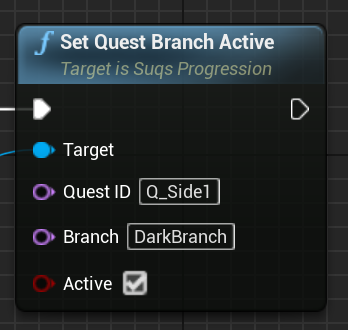
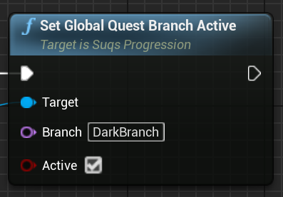

# Branching Quests

Although quests are mostly statically defined, that doesn't mean that every
player has to follow the same route through a quest. 

[Objectives](Objectives.md) represent the sequential path through the quest, 
but not all objectives need to be active at once. If you assign a Branch to an
Objective, which is just a name that you choose, then that Objective becomes
inactive *unless* that branch has been activated, either at the quest level, 
or globally.

This allows you to use a simple list of Objectives like a branching tree of
objectives, because the path simply follows top-down ordering but ignoring
any objective on a branch that's not active.

For example, let's say you want a quest which branches internally like this:

 

Each node in this graph is an Objective, and can have multiple tasks within it; 
the graph represents the overall branching structure.

To implement this as a sequence of objectives with branches, you could define
objectives like this:

|#|Objective|Branch|
--|--|--
1|Intro|None
2|Intro2|None
3|Dark1|Dark
4|Dark2A|DarkA
5|Dark2B|DarkB
6|DarkEnd|Dark
7|Light1|Light
8|LightEnd|Light

You can then enable branches to "turn on" objectives you need to follow the sequence
desired. For example, if you wanted to go through the "Dark2A" node, you'd
activate branches "Dark" and "DarkA". If you wanted the path through "Light1",
you'd just activate the "Light" branch only.

> It's a good idea to always have one of the branches enabled by default so that
> it's not possible to "fall through" to the end of the quest before you have time
> to decide which branch to take. So in this example, perhaps by default you'd enable the "Light"
> branch, and only switch it to "Dark" as needed. Otherwise if you completed "Intro2"
> before enabling ANY branch, that would complete the quest since no other objectives
> would be outstanding. You can set default branches in the quest definition.

The one limitation is that you can't have loops in you quest, or have 
completion of an Objective jump back to a previous point above the sequential list.
Simply ordering your nodes so everything is in global order of possibilities can
solve this, but you can't do pure loops or conditional jumps. 
This can be a source of bugs so is perhaps no bad thing. If you *absolutely* need to 
go backwards in a quest, there are "Reset" calls in the API you can use to undo progress,
which when the quest is re-evaluated, returns to a previous point.

## Activating Branches

To activate or deactivate a branch, you can either do it at the quest level:

Or at the global level for ALL quests, perhaps to represent a global decision 
which may affect multiple quests:

Changing branches has an immediate effect on quests, they are essentially 
re-examined from the top down based on the new activation, with all prior task
completion preserved. The next objective will be based on the new active branches,
which can cause the new next objective to be earlier in the list than before.