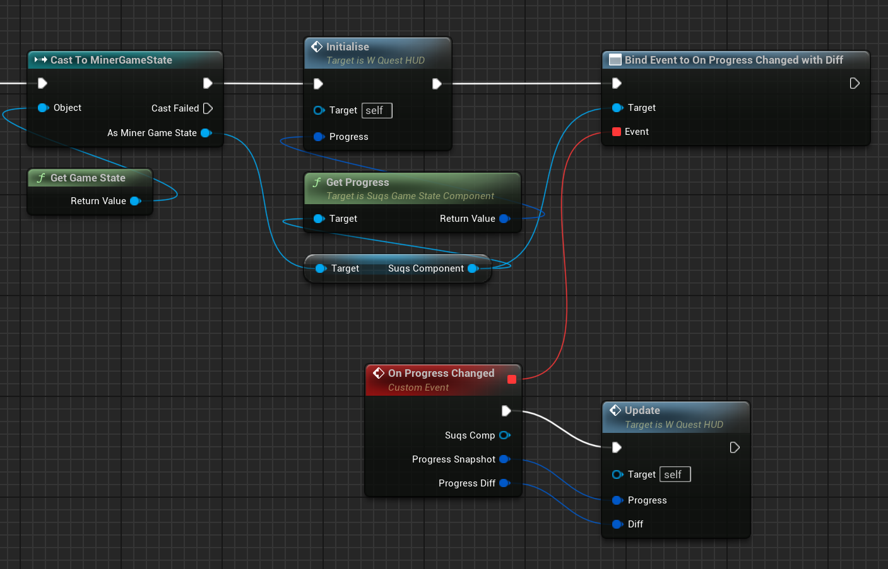

# Multiplayer Support

SUQS now supports multiplayer! However, there are some rules:

1. You must *only* interact with the main `USUQSProgression` API ***on the server***
    * That means accepting quests, progressing quests, defining new quests, everything.
    * Don't try to use any of the UObject-based classes on a client, except `USuqsGameStateComponent`
2. All your UI should *solely* use data sourced from the "Progression View System", which 
   is a replicated view layer of the quest state. This is accessible via `USuqsGameStateComponent`


## Getting started

The easiest way to support multiplayer for SUQS is to create an instance of `USuqsGameStateComponent` and attach it to your GameState class. For example:

```c++
// In your GameState header:
UPROPERTY(BlueprintReadOnly)
TObjectPtr<class USuqsGameStateComponent> SuqsComponent;
```

```c++
// In your GameState constructor
SuqsComponent = CreateDefaultSubobject<USuqsGameStateComponent>(TEXT("SUQS"));
```

Or you can add a component of type "Suqs Game State Component" in Blueprints.
This component is created on the client *and* the server, and handles all replication inside of itself.

## Accepting & progressing quests

**On the server only** you can call `SuqsComponent->GetServerProgression()` and call all [the usual progress API](Progression.md) on that. It would make sense to do that from your GameState itself. 

## Getting updates about Quest State

You will need to code your UI so that it runs on the server and clients the same way. In order for this to work,
you need to **only use** functions on `USuqsGameStateComponent` to read data. **Never EVER** try to access the
"U" classes like `USuqsProgression`, `USuqsQuestState` etc in UI that will run on the client. 

Luckily `USuqsGameStateComponent` provides you an easy API to receive quest updates. Here's a complete bootstrap for
UI, called during Construct.



Note how I call an Initialise function using the "Get Progress" pin on `USuqsGameStateComponent`, in case there are
quests already set up when we start up. Then, I bind an event to "On Progress Changed With Diff", which is called
back whenever anything changes, giving me both a snapshot of the quest state, and also a diff of what changed. 

I won't bore you with the UI details, but that's all that's needed to get all quest updates to the UI, and it
works identically on both server and clients. 

> You might notice is that you get different "View" structs out of this API and not the original 
> `USUQSQuestState` classes etc. That's because the server state is simplified to these structs for replication.

## How this works

Whenever changes are made to the quest state on the server, the server-side `USuqsGameStateComponent` receives the 
granular update events from the main API (which only works on the server). It collates these and updates the simpler
"View" state, which is replicated at the end of the tick.

Clients (and server) receive this replicated state in one go, but then the `USuqsGameStateComponent` calculates a diff
between them so it can provide as a convenience to listeners, rather than them having to re-build the state anew or
figure out their own differences. 

## See Also

* [Progression](Progression.md)
* [Tasks](Tasks.md)
* [Back to Top](../README.md)
