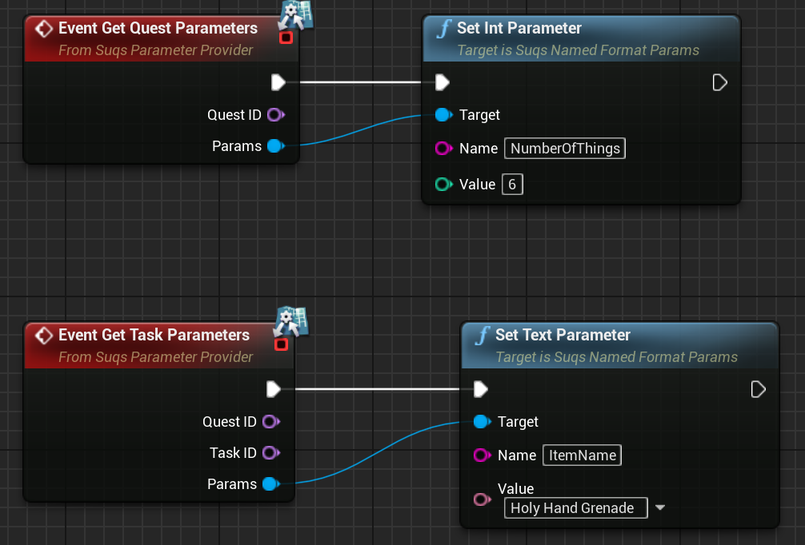
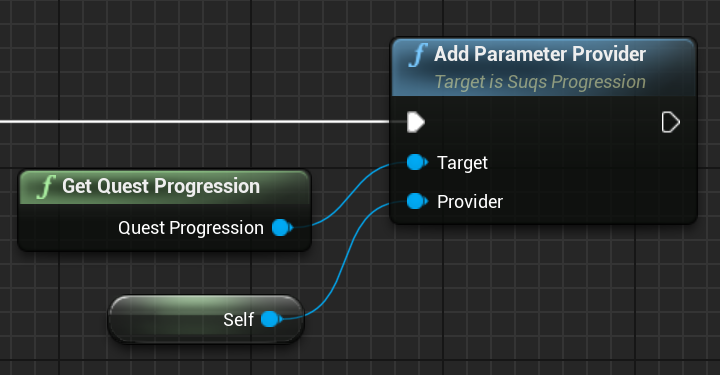

# Text Parameters

The title and descriptions of [Quests](Quests.md) and [Tasks](Tasks.md) can 
include parameters, so that you can substitute variable values into your
strings.

This works the same way as [text formatting in Unreal](https://docs.unrealengine.com/4.26/en-US/ProductionPipelines/Localization/Formatting/) using named parameters, for example:

```
Collect the {ItemName}
```

You might want to do this rather than having branches in your quest lines, where
the aim and structure of the quest is the same but the details are variable. 

## Definitions vs Progression Text

Quest definitions are static, so whenever you retrieve the title or description
directly from the definitions, the parameters will still be as written in the
original definition, e.g. `{ItemName}`.

However, when you call `GetTitle()` on the quest **state** that you get from the
[Progression](Progression.md) object, parameters will be replaced with values
wherever possible. 

Therefore in your quest UI you should always get the title and description from
the state objects on `USuqsProgression`.

## How Parameters Are Replaced With Values

### Implementing ISuqsParameterProvider
To provide parameter values, you should implement the `ISuqsParameterProvider`
interface on one or more of your objects. 

The implementation requires a single function, `GetQuestParameters`. 
You're given the identifier of the quest, and optionally the
identifier of the task that the text relates to (might be None if it's the
top-level quest). You also get a `Params` object, which you can populate with 
values. Here's a simple version in Blueprints:



In this case I'm not bothering to check the IDs of the quest/task, I'm just setting
up some parameters. It doesn't actually matter whether the text uses all these
parameters or not, they're just available if referenced. But, if you need to 
provide different values for different quests/tasks and use a single provider to
do it all, you can make parameter setting conditional on Quest/Task ID if you want. 

### Registering your parameter provider

To actually receive the `GetQuestParameters` call, you need to register your provider with the
`USuqsProgression` object you use for tracking quest progress (see [Progression](Progression.md)):



Providers are *all* given the opportunity to set parameters, in the order you
register them.

> **Important**:
> Providers are held by SUQS as a *weak pointer*; this is to allow you to use normal world
> objects to provide parameters, without worrying about them being kept alive
> beyond their normal lifespan (they will safely be unregistered when they've been
> garbage collected). But this also means you must have a strong
> pointer to your provider object somewhere to prevent it being garbage collected.

SUQS detects whether a title / description has parameters or not, and only calls
parameter providers when needed.


## More Info

* [Quests](Quests.md)
* [Tasks](Tasks.md)
* [Quest Progression](Progression.md)
