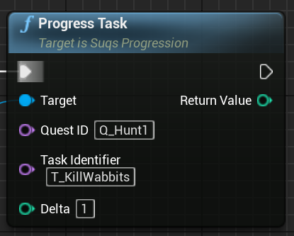
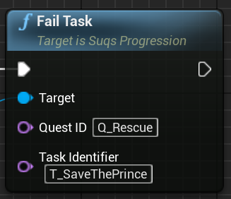

# Quest progression

We covered [how to define quests](Quests.md), now let's look at how you actually
progress through quests during gameplay.

The core object you need to do this is `USuqsProgression`. This is just a `UObject`,
so you can store it anywhere you like (in a `UPROPERTY`). Personally, I like to
store mine in my `UGameInstance` subclass, because that always exists across levels.

## Initialising the Quest Library

The first thing you ever need to do with progression is to tell it about the
quest library - that is to say all the quests that can ever be used. You should
do this at game init time, because it should only be done once. You want to tell
it which of the [quest assets](Quest.md) you want to be available in the game.

There are a couple of ways to do this:

1. Explicitly with a list of DataTables: `USuqsProgression::InitWithQuestDataTables`
2. Loading all DataTables in a path: `USuqsProgression::InitWithQuestDataTablesInPath[s]`

It's fine for that list of assets to change over the development of the game.
`USuqsProgression` only stores data about quests which have been accepted, and 
refers to the definitions by identifiers. More quests can be added later, and you
can even change existing quests so long as you're careful about what might already
be in a save game. See [Changing Quest Definitions](ChangingQuestDefinitions.md).

## Accepting Quests

The quest library is just a reference library of possible quests, and is only 
used by `USuqsProgression` once you *accept* a quest.

It's possible for quests to be auto-accepted as a result of other quests completing
or failing (see [Quest Definitions](Quests.md)), but otherwise accepting a quest
is an explicit call:

After accepting a quest, the state will be tracked in the active
quests list of `USuqsProgression`, until it either completes or fails.

After completion or failure, the quest state is stored in the quest archive, 
so you still have a record of, for example, which [Tasks](Tasks.md) were completed, 
and which [branches](Branching.md) were taken, in case you want to use that. 

## Progressing Quests

After acceptance, quest progression primarily happens through [Tasks](Tasks.md).
While you *can* tell the quest to complete or fail at the top level, all that 
really does is act as a shortcut to failing the current outstanding tasks. You 
should always move things forward at the Task level in normal circumstances.

While you *can* dig down through detailed quest, objective and task state using
the API, the top level `USuqsProgression` has all the functions you need to 
operate on tasks directly; you just need to know the Quest Identifier and the
Task Identifier. So to complete a task for example, you'd do this in your world
trigger:

If your task isn't a one-shot, but instead one which requires completing something
a number of times, you use the "Progress Task" call instead:

Progressing a task will automatically complete it when the required target number
is reached.

If there are conditions that can fail a task, you can trigger it using this call:

## Completing / Progressing / Failing tasks on ANY compatible quest

If you need to, you can omit the Quest ID from the complete / progress / fail calls
above, providing "None" instead. In that case, all active quests will be scanned
and sent the same request. Any that contain a task which matches that Task Identifier
(remember, Task Identifiers only have to be unique within the quest) will respond
as if you named them explicitly with their Quest ID.

## Completed Tasks

Completing a task may complete the parent [objective](Objectives.md), if:

* it's a mandatory task, and
* the number of completed tasks fulfils the objective's NumberOfMandatoryTasksRequired

If that's true and there are no more active objectives to complete, this will
complete the quest as well.

## Failed Tasks

Failing a task *may* fail the parent objective, if:

* The task is mandatory, and
* It's not possible to complete the parent objective with any remaining tasks

Failing the current objective fails the quest.

## Events

State changes to the quest raise events. See [Events](Events.md) for more details.

## Resetting Progress

You can reset quests at various levels, including restarting failed quests.
The "Accept Quest" function actually resets failed quests by default. Any other
quests you can restart using the `Reset` function. You can also reset specific
objectives or tasks if you just want to re-do a particular part of a quest.

