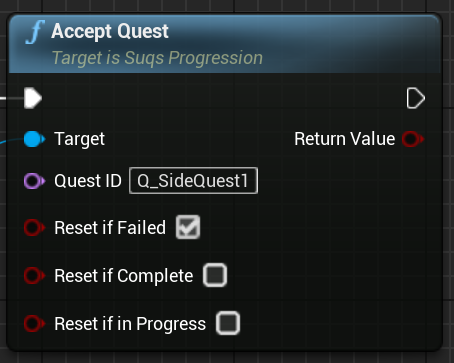
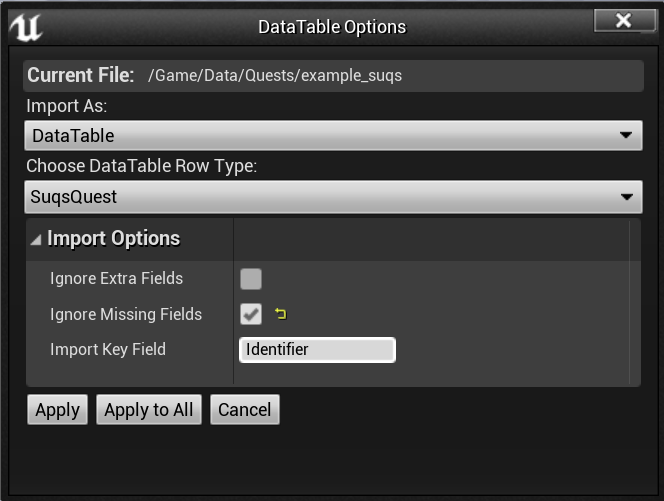

# Quests

The linchpin of any quest system is...the quests! These are the individual stories
your game is telling; even if you're not making an RPG, it's useful to track the
state of your story explicitly. That way, it's easy to know where you are in the
story, whether there's just one or many, and to trigger dependent changes in your
world based on that.

Quests are self-contained story chunks. All the possible quests in the game are known as
the "Quest Library". Quests are only active after being accepted,
which you do through the [quest progression instance](Progression.md):



Once a quest is accepted, its state will be tracked. Once completed or failed, 
the quest will become part of the quest archive.

## Quest Structure

Quests are structured something like this:

* Quest
  * Objective
    * Task
    * Task
  * Objective
    * Task


Quests are made up of a series of one or more [Objectives](Objectives.md).
Objectives are groupings of one or more [Tasks](Tasks.md) which must be completed 
to progress. Objectives are sequential, although not all of them may be active 
(see [Quest Branching](Branching.md)), while Tasks may be sequential or flexibly ordered.

It's up to you how large or small quests are. There is no limit on the number of 
quests that can be accepted at once, or how many objectives / tasks make up
those quests.

## Quest Completion

Quests are considered complete when there are no more incomplete Objectives outstanding,
based on the [branches](Branching.md) which are enabled.

Quests can depend on each other, so that later quests can be automatically
accepted when others succeed (or fail).

## Quest Failure

A quest fails if any active objective fails. Objectives are made up of [Tasks](Tasks.md)
which can add nuance to what is actually considered an Objective failure.

## Defining the Quest Library

Quests are defined in [datatable
assets](https://docs.unrealengine.com/en-US/InteractiveExperiences/DataDriven/#datatables).
You can have as many quests as you like, defined in as many separate assets as
you like; the "quest library" is the combination of all the assets you decide
to reference in the [quest progression instance](Progression.md). 

You can either define quest datatables in the editor, or import JSON: I recommend
the JSON route, because if you store JSON alongside your datatable assets in 
version control, it's much easier to track the history of your quest changes. 

### Using JSON

> Any editor which supports JSON Schema can provide autocomplete and tooltip 
> documentation for the quest JSON format. See the [Editor Setup](EditorSetup.md) 
> section for instructions on how to set that up.

Here's a mid-size quest definition as an example. This doesn't actually include
all the options, since you can omit things and leave them to the defaults. 

```json
[
	{
		"Identifier": "Q_Side1",
		"Title": "NSLOCTEXT(\"TestQuests\", \"SideQuest1Title\", \"Side Quest 1\")",
		"DescriptionWhenActive": "NSLOCTEXT(\"TestQuests\", \"SideQuest1DescActive\", \"This is one of those side quests you really play the game for\")",
		"Objectives": [
			{
				"Identifier": "O_MeetWizard",
				"Title": "NSLOCTEXT(\"TestQuests\", \"MeetTheWizard\", \"Meet The Wizard\")",
				"DescriptionWhenActive": "NSLOCTEXT(\"TestQuests\", \"MeetTheWizardDesc\", \"So this is where you go meet the wizard\")",
				"bSequentialTasks": true,
				"Tasks": [
					{
						"Identifier": "T_ReachWizardLand",
						"Title": "NSLOCTEXT(\"TestQuests\", \"ArriveAtWizardshire\", \"Arrive At Wizardshire\")",
						"bMandatory": true
					},
					{
						"Identifier": "T_EnterTower",
						"Title": "NSLOCTEXT(\"TestQuests\", \"EnterTheTower\", \"Enter the tower\")",
						"bMandatory": true
					},
					{
						"Identifier": "T_TalkToWizard",
						"Title": "NSLOCTEXT(\"TestQuests\", \"TalkToDerekTheWizard\", \"Talk to Derek the Wizard\")",
						"bMandatory": false
					}
				]
			},
			{
				"Identifier": "O_KillWizard",
				"Title": "NSLOCTEXT(\"TestQuests\", \"KillDerek\", \"Kill Derek The Asshole Wizard\")",
				"DescriptionWhenActive": "NSLOCTEXT(\"TestQuests\", \"KillDerekDesc\", \"Turns out Derek is an asshole. Sort him out.\")",
				"bSequentialTasks": true,
				"Tasks": [
					{
						"Identifier": "T_DropShield",
						"Title": "NSLOCTEXT(\"TestQuests\", \"DropDereksShield\", \"Make Derek Drop His Shields\")",
						"bMandatory": true
					},
					{
						"Identifier": "T_MercDerek",
						"Title": "NSLOCTEXT(\"TestQuests\", \"MercDerek\", \"Merc Derek\")",
						"bMandatory": true
					},
					{
						"Identifier": "T_InsultDerek",
						"Title": "NSLOCTEXT(\"TestQuests\", \"InsultDerek\", \"Call Derek's Lineage Into Question\")",
						"bMandatory": false
					}
				]
			}
		]
	},
]
```

We'll talk more about the attributes contained in the JSON below. There are many
defaults so you you don't need to specify everything, the example above includes
some attributes which could be omitted as defaults, but there are several more 
attributes it doesn't show. They will be covered in more detail below and in 
the [Objective](Objectives.md) and [Task](Tasks.md) sections.

To import this JSON file as quest data in the Unreal Editor, simply place it in
your content folder and confirm the import with these options:

* Import As: DataTable
* Row Type: SuqsQuest
* Ignore Missing Fields: true (this means you can omit things to get the defaults)
* Import Key Field: Identifier




The "Import Key Field" option is there because UE requires that every row in 
a DataTable has a Row Name; to avoid you having to add that, this tells UE to 
use the existing Identifier for that as well.

You can also create blank DataTables based on the SuqsQuest row type, and create
data directly in the editor instead. However, I strongly recommend using JSON
and storing both the JSON and the imported datatable in source control.

### Packaging: Cooking Quest Data

Probably you're going to use `USuqsProgression::InitWithQuestDataTablesInPath[s]`
to pull in these quest definitions (see [Progression](Progression.md)). 
However, this means that your quest data assets won't be explicitly referenced,
and therefore won't be cooked into packaged builds by default.

The easiest way to fix this is:

1. Open Project Settings
1. Go to Project > Packaging
1. Find "Additional Asset Directories To Cook" and add an entry
1. Use the "..." button to locate the directory containing your quest data assets

This way anything in that folder will be included in the package without it needing
a direct reference.

## Quest attributes

Here's a bit more information about the attributes at the top layer of every quest.

### Identifier

All quests must have a unique identifier. This is what you'll use to accept quests, 
and to refer to them throughout the system. I suggest a naming convention of "Q_Something",
but really it's up to you.

Identifiers are `FName`s which are kind of like entries in a constant table of strings,
making them faster to use as lookups than regular strings. If you're using C++,
 it's beneficial to define them as constants rather than directly embedding them 
 as literals in code, e.g. 
 
```c++
// Define constant names somewhere globally
const FName Q_MainQuest("Q_MainQuest");
```
```c++
// Use the pre-made FNames instead of constructing FNames at the call site (implicitly or explicitly)
Progression->AcceptQuest(Q_MainQuest);
```

In Blueprints Unreal uses FNames optimally for you. But, it can still be useful to 
predefine the names somewhere, so that if you rename something it's easier to fix
everywhere.

### Player Visible

This is a hint to any quest UI that this quest should or should not be displayed
to the player. You might want to use internal quests to track the internal state
of a story sequence, without necessarily exposing that to the player.

### Title

This is the player-visible title of the quest. To make this text localisable, 
it's a good idea to use the NSLOCTEXT macro, which works the same way as in C++
except you have to use backslash to escape the embedded quotes:

```json
"Title": "NSLOCTEXT(\"Namespace\", \"Key\", \"Default Text\")",
```

The namespace is anything you like, it's used to separate localisation data into
groups, so you could just use your project name if you don't need to split 
things up. Or you could use something like "QuestsText" to keep all the quest
text together in the localisation data, separate to other data. Up to you.

The Key has to be unique in that namespace. You can make a key up, in which case
you need to ensure it's unique, if it's not you'll end up with the same text as
the other place you used that key. You can also generate some unique string,
such as a GUID from your editor.

Your title text can include named variable parameters if you like, see 
[Parameters](Parameters.md) for more information.

### Description When Active

This is the description of the quest when it's not completed. Localisable text.
The description of a quest can change as it progresses by using the description 
attributes on [Objectives](Objectives.md).

Your description text can include named variable parameters if you like, see 
[Parameters](Parameters.md) for more information.

### Description When Completed

This is the description of the quest when it's completed. Localisable text.
If blank, use the active description.

### Auto-Accept

By default quests are only accepted by calling the `AcceptQuest` function on
the [Progression](Progression.md) object. However if you enable this option, 
a quest can automatically be accepted when other quests are completed, or fail.

See the prerequisites attributes below. 

### Prerequisite Quests

If the Auto-Accept option is enabled, then this quest will be automatically accepted
when ALL of the quests identified in this list complete successfully. Can be
combined with Prerequisite Quest Failures (both conditions must be fulfilled).

### Prerequisite Quest Failures

If the Auto-Accept option is enabled, then this quest will be automatically accepted
when ALL of the quests identified in this list fail. Can be
combined with Prerequisite Quests (both conditions must be fulfilled).

### Default Active Branches

When you're making [branching quests](Branching.md) with mutually exclusive paths, you'll
want to set certain branches active by default so that, if you don't change anything, the
quest always has a default path to go down. 

### Resolve Automatically

Whether to automatically resolve the outcome of this quest completing / failing,
such as updating the quest lists, and activating dependent quests. Defaults to true.
If set to false, this quest will only be resolved after a call to `ResolveQuest`.
Combines with Resolve Delay and Resolve Gate below.

This lets you precisely control when the next steps in the quest line are activated, instead
of happening immediately on completion/failure, which can be useful for narrative pacing.

### Resolve Delay

When this quest completes or fails, a time delay can be added before the knock-on effects 
of this are resolved, such as updating the quest lists, and activating dependent quests.
It defaults to -1 which means to not add a specific delay to this quest, and to use whatever
defaults are set in [Progression](Progression.md).

Combines with Resolve Automatically and Resolve Gate - all must be cleared to resolve.

### Resolve Gate

Much like Resolve Delay, this adds a delay between completing/failing the quest, and
the knock-on effects; except this time the delay is user-controlled, and will only be
activated when the named "Gate" is opened on [Progression](Progression.md).

Combines with Resolve Automatically and Resolve Delay - all must be cleared to resolve.

### Objectives

The list of [Objectives](Objectives.md) which make up this quest.

## More Info

* [Objectives](Objectives.md)
* [Tasks](Tasks.md)
* [Quest Progression](Progression.md)
* [Text Parameters](Parameters.md)
* [Saving Data](Saving.md)
* [Changing Quest Definitions](ChangingQuestDefinitions.md)


