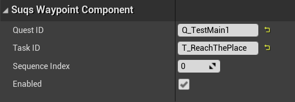

# Waypoints

Everything else in SUQS is merely state data and has no connection with any
world objects. However, often you'll want to put markers in the world to guide
players to the location of tasks in the world; these are called Waypoints.

SUQS provides a few helpful tools in this area; you don't have to use them,
but they can be convenient.

## Waypoint component

SUQS contains a scene component subclass called `USuqsWaypointComponent`. 
If you attach this to an actor in your scene, then it will connect SUQS tasks to 
locations in the world.

Here's how you configure it:

You need to supply a Quest ID and Task ID at a minimum, neither of which can be
changed at runtime.

## Getting Waypoints

Waypoints are loosely associated with quest data via IDs, but at runtime
when a level is loaded, any waypoints in the level will be registered and
connected to quest state data. 

See the [Progression](Progression.md) documentation on how quest state is handled.
Normally you'll want to access waypoints when a new task becomes active; one way
is listening in to the `USuqsProgression::OnProgressionEvent` callback,
and looking for the `ESuqsProgressionEventType::TaskAdded` event.

On receipt of this, you can access waypoints via `USuqsTaskState::GetWaypoints`. 
You can then track this in your UI relative to your camera, map etc.

## Multiple Waypoints per Task

You can associate multiple waypoints with a single task - this might be because
it's possible to complete a task in multiple places, or that there's a sequence
of waypoints. 

In the latter case, SequenceIndex can allow you to order them
reliably in the return from `GetWaypoints`. However, consider whether it might
be better to split the task up rather than have a sequence of waypoints, if it's
any more complicated than just describing a path.

## Waypoint enable/disable

Waypoints can also be enabled / disabled, in case you want to temporarily hide or
show them. `GetWaypoints` can include or exclude disabled waypoints, and if you
listen in to `USuqsProgression::OnProgressionEvent`, you will receive an event 
of type `ESuqsProgressionEventType::WaypointEnabledOrDisabled` when that changes
dynamically.

## Movable Waypoints

The actor that the waypoint component is attached to can move, and if it does
while the task it's associated with is current, `USuqsProgression::OnProgressionEvent`
will raise an event of type `ESuqsProgressionEventType::WaypointMoved`.

This means you don't have to do your own monitoring of the position of waypoint
actors. You can just read the position on task addition, and only worry about
changes via the event above - they will only be sent while the task is current and
incomplete.

## Removing waypoints

How do you know when to stop displaying waypoints? Again, the `USuqsProgression::OnProgressionEvent`
callback is the easiest way; based on the event type (`ESuqsProgressionEventType`):

1. `WaypointEnabledOrDisabled`: and the passed in waypoint `IsEnabled()` returns false
1. `TaskCompleted`, `TaskFailed` or `TaskRemoved`: remove any waypoints associated with this task. All 3 can happen independently, since `TaskRemoved` can occur for incomplete, optional tasks.

## More Info

* [Tasks](Tasks.md)
* [Quest Progression](Progression.md)
* [Changing Quest Definitions](ChangingQuestDefinitions.md)